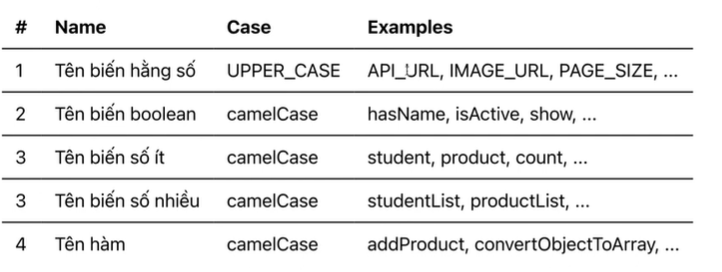

# Những điều cơ bản trong TypeScript
## TypeScript

### 1. Static type checking
- TypeScript giúp phát hiện ra lỗi ngay trong lúc code.
- Giúp tránh lỗi type
- Tiết kiệm thời gian debug 

### 2. Types for Tooling
- TypeScript con giúp hạn chế lỗi bằng việc hỗ trợ auto completions

# Explicit type vs infered type

### 1. Explicit types (tường minh)
* khai báo kiểu dữ liệu trong typescript thì sử dụng 2 dấu chấm đằng sau tên biến

```
let count: number = 123;
let stundentName: string = 'hung';
```

### 2. Infered Types (Tự suy diên)
* TS thông minh detect được kiểu dữ liệu tương ứng  ngay cả khi mình không khai báo cụ thể kiểu dữ liệu.

```
let count = 123;
let stundentName = 'hung';
```

### 3. Eraised types
* Sau khi compile từ typescript sang javascript, tất cả type annotation sẽ bị xóa

# Strictness - Tìm hiểu về strict flag
* strict flag là gì?
* `nolmplicitAny`
- Khi TS không thể xác định được kiểu dữ liệu của 1 biến, thì biến đó sẽ mang kiểu `any`
- khi bật `true`, nó sẽ báo lỗi nếu trường hợp này xảy ra.
* `stricNullChecks`
- khi bật lên true sẽ báo lỗi `null/undefined` được sử dụng không đúng. Ví dụ như gọi những hàm number, string, aray

# Equality / Comparison in TS
### 1. Nhắc lại về == và === bên JavaScript
* So sánh khác kiểu dữ liệu với `==`, thì sẽ được chuyển về number để so sánh.
* Với 3 dấu `===` thì sẽ giữ nguyên giá trị để so sánh

- Bên Typescript
* kiểm tra kiểu dữ liệu thì dù dùng `==` hay `===` mà khác kiểu dữ liệu vẫn báo lỗi.

### 2. So sánh object
* object, array và function là tham chiếu
* Khi so sánh 2 tham chiếu, thì địa chỉ của tham chiếu được so sánh, chứ không phải giá trị thật

# Const amd let
* khi sử dụng với const
- Dùng cho hằng số UPPER_CASE
- Dùng cho biến mà không có nhu cầu thay đổi giá trị. camelCase  

* khi sử dụng với let
- Dùng cho những biến có nhu cầu thay đổi bằng việc thực hiện phép gán

`Naming convention`

